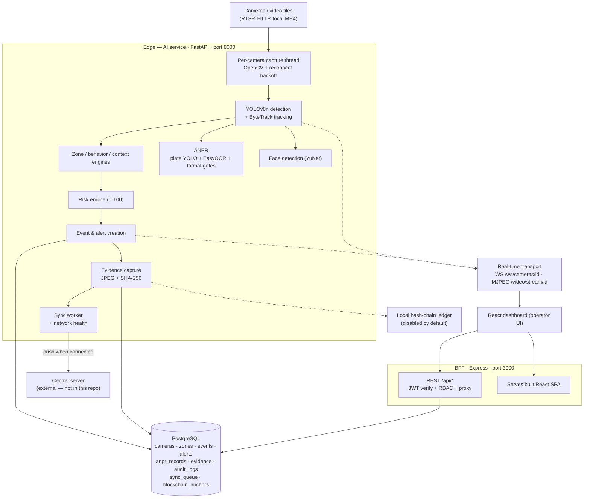

# IBVAP — Intelligent Border Video Analytics Platform

> AI video analytics that turns ordinary surveillance cameras into automated border monitoring: it detects and tracks people and vehicles, evaluates zone and behavioral risk, raises alerts, and captures SHA-256 hash-verified evidence — designed to keep working on bandwidth-constrained, intermittently connected sites.


**Status:** engineering prototype under active development. Implemented, experimental, and planned capabilities are explicitly labeled throughout this document. Start with [Limitations](#limitations) if you are evaluating readiness.

---

## Table of Contents

- [Overview](#overview)
- [Problem](#problem)
- [Our Solution](#our-solution)
- [Key Capabilities](#key-capabilities)
- [System Architecture](#system-architecture)
- [AI / Computer Vision Pipeline](#ai--computer-vision-pipeline)
- [End-to-End Data Flow](#end-to-end-data-flow)
- [Technology Stack](#technology-stack)
- [Repository Structure](#repository-structure)
- [Core Modules](#core-modules)
- [ANPR](#anpr)
- [Events, Alerts & Risk](#events-alerts--risk)
- [Evidence & Integrity](#evidence--integrity)
- [Security](#security)
- [Edge–Central Architecture](#edgecentral-architecture)
- [Dashboard](#dashboard)
- [API](#api)
- [Real-Time Communication](#real-time-communication)
- [Installation](#installation)
- [Configuration](#configuration)
- [Running the System](#running-the-system)
- [Sample Data & Models](#sample-data--models)
- [Testing & Validation](#testing--validation)
- [Performance / Results](#performance--results)
- [Limitations](#limitations)
- [Future Scope](#future-scope)
- [References](#references)

---

## Overview

**What IBVAP is.** IBVAP is an edge-first video analytics platform. A Python AI service ingests camera streams (RTSP, HTTP, or video files), runs detection and tracking on every camera independently, reasons about zones and behavior, and produces alerts with attached photographic evidence whose integrity is cryptographically verifiable. A web dashboard gives operators a live, multi-camera command view.

**The problem it solves.** Conventional CCTV records footage but does not understand it. Monitoring many feeds manually does not scale: operators miss events, post-incident review is slow, and recorded media can be altered without detection. Remote and border sites add poor connectivity, so cloud-only designs fail exactly where monitoring matters most.

**Who uses it.** Security operators and commanders at a monitoring post (single-pane multi-camera view), and administrators who configure cameras, zones, and accounts. The system is designed around fixed perimeter cameras (the seeded demo camera is modeled as a base-of-post main gate).

**Environment it is designed for.** Fixed IP cameras or local video files; CPU-first operation (GPU optional); sites with intermittent uplinks where events must be recorded locally and synchronized to a center when connectivity returns.

**The core idea.** Analyze at the source, verify before acting, respond with evidence:

- **DETECT** — detect and track objects of interest on every camera continuously.
- **VERIFY** — only trusted observations become alerts: zone rules, behavior thresholds, temporal confirmation, risk scoring, and (for ANPR) format and confidence gates.
- **RESPOND** — raise a severity-ranked alert, capture hash-verified evidence, persist records, sync when connected, and show it live on the dashboard.

**What makes it different from conventional CCTV.** A recorder answers "what happened?" only after someone scrubs tape. IBVAP answers "what is happening now?" continuously and autonomously, pushes the answer to an operator within seconds, and attaches tamper-evident proof. Offline operation is a first-class mode: the edge node keeps producing events and evidence with no uplink and forwards them later.

**Camera input → final alert, in one pass:** each camera's dedicated thread reads frames → YOLOv8 detects persons/vehicles → ByteTrack assigns stable IDs → zone/behavior engines evaluate the frame against virtual fences and rules → the risk engine scores the result → if the event survives confirmation, an alert row and evidence (JPEG snapshot + annotated crop, SHA-256 hashed) are written locally → the dashboard receives the update over a per-camera WebSocket in real time → the sync worker forwards events/evidence to the central server when the link is up.

---

## Problem

Limitations of conventional border/perimeter surveillance that IBVAP is built to remove:

| Area | Limitation |
|---|---|
| Manual monitoring | Operators cannot watch multiple feeds continuously; attention degrades, events are missed, and response is reactive rather than real-time. |
| No semantics | A traditional NVR stores video but cannot distinguish a person crossing a fence line from a bird; searching hours of footage after an incident is manual and slow. |
| Response latency | Without automated detection, the time from event to awareness is bounded by human review cycles, not by the event itself. |
| Connectivity | Border and remote sites have limited or unreliable links. Designs that require constant cloud connectivity lose monitoring exactly when links fail. |
| Evidence integrity | Screenshots and clips are trivially editable. Without hashes or tamper-evidence, footage is weak material for audits and legal proceedings. |
| Multi-camera fragmentation | Independent cameras produce disconnected views; there is no unified operational picture or single alert surface. |
| Infrastructure | Commercial VMS stacks are license-bound and appliance-centric; deploying, updating, and auditing them across many small posts is costly. |

---

## Our Solution

### DETECT

Per-camera ingestion through OpenCV (`cv2.VideoCapture` with FFmpeg backend, configurable open/read timeouts, small read buffer). Every camera runs in its own daemon thread with its own pipeline instance — tracker state, engines, and models are isolated per camera. Detection runs at a configured cadence (`INFERENCE_FPS=10` by default):

- **YOLOv8n** detects the surveillance classes of interest (person, bicycle, car, motorcycle, bus, truck), with quality filters (minimum box area, person aspect ratio, 2-frame temporal confirmation).
- **ByteTrack** (via Ultralytics `model.track`) assigns persistent track IDs and maintains track buffers across missed detections.
- **Full-frame license-plate YOLO** runs independently of vehicle detection and is associated to vehicle tracks by strict bounding-box containment (`associate_plates_to_vehicles`).

### VERIFY

Observations are filtered before they can become alerts:

- **Zone rules** — polygons (restricted areas) and tripwires (lines) drawn on the dashboard and stored in the database; evaluated live against the ground point of each track (ray-cast point-in-polygon; sign-change crossing for tripwires).
- **Behavior rules** — loitering duration, night-window movement (22:00–05:00 configurable), dwell threshold, fence proximity, repeated entry within a time window.
- **Temporal confirmation** — events need multi-frame evidence; orphaned events auto-resolve after 30 frames.
- **Risk scoring** — a 0–100 weighted score (event type, zone severity, behavior, confidence) with thresholds at 25/50/75; the effective severity of an alert is the higher of its base severity and its risk-derived severity.
- **ANPR gates** — OCR confidence floor (0.5), Indian plate format validation, temporal stabilization over a per-track observation window, and a persistence gate requiring status + text + valid format. The conservative correction engine refuses to fabricate characters.

### RESPOND

- Alerts with three-level severity (CRITICAL / MEDIUM / LOW), deduplicated and escalated per event.
- Live delivery over per-camera WebSocket (~10 messages/s per camera) plus REST polling fallback.
- Evidence capture at episode start: full-frame JPEG snapshot + annotated target crop (red box + label), both SHA-256 hashed, optionally anchored in a local hash-chain ledger.
- Local persistence (PostgreSQL) with an outbound **store-and-forward** sync queue and a network-health state machine for intermittent links.
- Operator dashboard: live camera grid with bounding-box overlays, alert triage (acknowledge/resolve), analytics, ANPR search, and report views.

---

## Key Capabilities

| Capability | What it does | How (technically) | Status |
|---|---|---|---|
| Multi-camera ingestion | Any number of concurrent streams | One daemon thread + isolated pipeline per camera; RTSP/HTTP/file sources; exponential reconnect backoff (1 s → 30 s, infinite retries) | Implemented |
| Object detection | Persons and vehicles in each frame | YOLOv8n (COCO-pretrained), conf 0.45 effective / IoU 0.45, imgsz 640 (960 for >1920 px frames), 6-class filter | Implemented |
| Multi-object tracking | Stable IDs across frames | Ultralytics ByteTrack (`bytetrack.yaml`, `persist=True`) | Implemented |
| Virtual fence | Restricted zones and line crossings | Polygon ray-cast + tripwire sign-change; zones CRUD in DB pushed live to pipelines; drawn in the UI | Implemented |
| Behavior analysis | Loitering, night movement, suspicious activity | Threshold engines over track position histories (30 s loitering, 22:00–05:00 night window, configurable) | Implemented |
| Context intelligence | Dwell, fence proximity, repeated entry, direction | `ContextEngine` signals feeding risk scoring and live metadata | Implemented |
| Risk scoring | Ranked threat assessment | Weighted 0–100 score, thresholds 25/50/75; severity = max(base, risk) | Implemented |
| Alerting | Timely, deduplicated operator alerts | Create/escalate/update per event; 3-level severity policy; REST + WebSocket | Implemented (ack/resolve persists in-memory only — prototype) |
| Evidence capture | Tamper-evident proof of an event | JPEG snapshot + annotated crop at episode start; SHA-256 per file; DB row + audit entry | Implemented |
| Integrity ledger | Verifiable evidence anchoring | Local SHA-256 hash chain in `blockchain_anchors` table; verify/reconcile endpoints | Implemented, **disabled by default** (`BLOCKCHAIN_ENABLED=false`) |
| Store-and-forward sync | Survive connectivity loss | `sync_queue` table + background worker (10 s interval, batch 20, exponential backoff 2ⁿ capped 60 s, 5 retries) + network-health state machine (CONNECTED/DEGRADED/OFFLINE) | Implemented outbound; central receiver **not part of this repo**; off in `.env.example` |
| ANPR | Read plates from vehicles | Full-frame plate YOLO → vehicle association → EasyOCR (3 preprocessing variants) → format validation → temporal stabilization → persistence gate; REST API + dashboard tab | **Experimental** — see [ANPR](#anpr) |
| Face detection | Locate faces in person regions | YuNet ONNX via `cv2.FaceDetectorYN`, every 2 frames, associated to person tracks (overlap ≥ 0.4) | Implemented (detection only — no recognition, no matching, no biometrics) |
| Camera management | Register/control cameras | REST CRUD, start/stop/restart, per-camera AI toggle (stream stays up), SD-card footage sync hook, audit-logged | Implemented (ONVIF footage retrieval is a stub) |
| Authentication | Identity | JWT (HS256, python-jose) issued by FastAPI; bcrypt password hashing; Express verifies the same token | Implemented |
| RBAC | Least privilege | 3 roles (ADMIN / OPERATOR / VIEWER) × 19 permissions enforced server-side on every route; mirrored role guards in Express | Implemented |
| Audit logging | Accountability | `audit_logs` table: camera lifecycle, evidence capture/verify/delete, network state changes, sync results, edge auth, ledger events | Implemented (no read API yet) |
| Real-time updates | Live dashboard | Per-camera WebSocket pushing full pipeline metadata; MJPEG annotated stream | Implemented |
| Live video display | Operator video wall | MJPEG multipart (`multipart/x-mixed-replace`) into `` tiles with bbox/face overlays | Implemented |
| Gemini frame analysis | Optional scene description | Express `POST /api/analyze-frame` → `gemini-2.5-flash` when `GEMINI_API_KEY` is set | Implemented (optional) |
| ONVIF discovery, video-clip evidence, DB-persisted alert ack, central ingestion service, Hyperledger adapter | — | — | **Not implemented** (stub or planned) |

---

## System Architecture



**Corrections relative to a naive layered diagram:**

- The frontend does **not** fetch real-time data through the API layer: WebSocket and MJPEG connect directly to the AI service (`:8000`) with a token; REST goes through the Express BFF (`:3000`).
- Express does not own the database; it proxies to FastAPI for almost everything (a few demo/legacy endpoints read small in-memory stores — see [API](#api)).
- Sync is a parallel egress path from the edge to an external central server; the central side is out of scope of this repository.

**How components communicate:**

| Path | Protocol | Purpose |
|---|---|---|
| Camera → AI service | RTSP / HTTP (TCP), OpenCV+FFmpeg | Frame ingestion with timeouts and reconnect |
| UI → BFF | HTTP (same-origin `:3000`) | Auth, RBAC-guarded REST, SPA hosting |
| BFF → AI service | HTTP (`AI_SERVICE_URL`, default `http://localhost:8000`) | Proxy for status, cameras, alerts, zones, ANPR, videos, network |
| UI → AI service | WebSocket `?token=` | Per-camera live metadata (detections, events, alerts, faces, ANPR, risk, health) |
| UI → AI service | MJPEG `?token=` | Annotated live video per camera |
| AI service → PostgreSQL | SQLAlchemy async (asyncpg) | All persistence |
| AI service → central | HTTPS (when `SYNC_ENABLED`) | Store-and-forward of events/evidence |
| Processes | `scripts/start-ibvap.ps1` or manual terminals | Startup orchestration |

---

## AI / Computer Vision Pipeline

### YOLO — object detection

| Aspect | Value |
|---|---|
| Model / library | Ultralytics **YOLOv8n** (`models/vehicle/yolov8n.pt`, COCO-pretrained — not custom-finetuned) |
| Purpose | Detect persons and vehicles |
| Input | Frame resized to 640×640 (960×960 when frame width > 1920), BGR |
| Output | Boxes for class IDs `{person, bicycle, car, motorcycle, bus, truck}` (COCO IDs 0,1,2,3,5,7); other classes filtered out |
| Integration | `tracking/tracker.py` — `YOLO(model_path)` loaded once, `model.track(..., persist=True)` per frame |
| Thresholds | Effective detection conf **0.45** (`MIN_TRACKING_CONFIDENCE` passed to `track()`); IoU 0.45 (`IOU_THRESHOLD`); note: `CONFIDENCE_THRESHOLD=0.50` is used by the separate health-check detector, not the tracking path |
| Post-processing | Min bbox area 0.2% of frame (persons exempt), person aspect ratio 0.2–4.0, temporal confirmation over 2 frames, optional static suppression (off by default) |
| Cadence | `INFERENCE_FPS=10` (configurable) |

### ByteTrack — multi-object tracking

| Aspect | Value |
|---|---|
| Model / library | Ultralytics built-in tracker, `tracker=bytetrack.yaml` |
| Purpose | Stable track IDs, association across occlusion/missed frames |
| Input / output | Per-frame detections → track IDs + track histories (`position_history`, up to 200 points) |
| Integration | Same `model.track()` call as detection; `persist=True` keeps state between frames |
| Tuning in repo | `TRACK_BUFFER=30` and `MATCH_THRESHOLD=0.8` are declared in config but **not currently passed** to the tracker (Ultralytics defaults apply) — see [Limitations](#limitations) |
| Consumers | Zone/behavior/context engines, risk engine, evidence crop labeling, ANPR association, face-to-person association |

### ANPR — automatic number-plate recognition

Status: **experimental, under active development.** Full detail in the [ANPR](#anpr) section.

| Aspect | Value |
|---|---|
| Model / library | YOLO plate detector (`models/license_plate/license_plate_detector.pt`, single class `license_plate`, ~6 MB) + EasyOCR |
| Purpose | Detect plates, associate to vehicles, read text |
| Input | Full frame every frame → plate boxes → strict-containment association to vehicle tracks → per-track plate crops |
| Output | Per-track observations: raw OCR text, normalized text, confidence, format status, corrected text |
| Thresholds | Plate conf ≥ 0.4 (`ANPR_MIN_PLATE_CONFIDENCE`); OCR conf ≥ 0.5 for confidence-qualification (`ANPR_MIN_OCR_CONFIDENCE`); OCR runs on first sighting and every 10 frames per track |
| Gates | Indian plate format validation; temporal stabilization (window 20, statuses DETECTED → RECOGNIZED → CONFIRMED); persistence gate = status + non-null text + format VALID |
| Tracking | Uses the vehicle track's plate observation history; miss-grace 10 frames before cleanup |

### OCR — plate text reading

| Aspect | Value |
|---|---|
| Model / library | **EasyOCR** `Reader(["en"])`, CPU by default (`ANPR_OCR_GPU=false`); a Tesseract path exists if EasyOCR is unavailable |
| Purpose | Read plate text from crops |
| Preprocessing variants | (1) `primary` — grayscale + cubic upscale to height 80; (2) `2x-upscale` — additional 2× (`ANPR_OCR_PASSES=2`); (3) `thr64` — reference-style `cv2.threshold(gray, 64, 255, THRESH_BINARY_INV)` on the preprocessed frame (`ANPR_OCR_THRESHOLD_VARIANT=true`) |
| Candidate handling | All variants' readings are collected pre-dedup; each candidate carries raw text, normalized text, confidence, format status, confidence-qualified flag, and proposed correction |
| Ranking rule | format-VALID ∧ conf ≥ 0.5 → conf ≥ 0.5 → format-VALID (diagnostic) → rest; ties: higher confidence, then lexicographic normalized text (deterministic, unit-tested) |
| Normalization | Uppercase, strip separators, alphanumeric only; letter↔digit confusion map (`O→0, I→1, Z→2, S→5, B→8, …`) used only inside position-constrained correction |
| Correction | `contextual_correct`: positional confusable swap only when the string matches an Indian plate layout; **refuses when no layout matches — never fabricates**; applied to plate text only after temporal consensus |
| Observability | Per-candidate bounded log (≤ 1000 records) with selection reason (`selected`, `lower_rank`, `duplicate_normalized`, `rejected_low_confidence`, `no_candidates`, `single_fallback`) |

### Face detection

| Aspect | Value |
|---|---|
| Model / library | **YuNet** DNN (`models/face/face_detection_yunet_2023mar.onnx`) via `cv2.FaceDetectorYN` |
| Purpose | Locate faces for presence metadata |
| Input / output | Person-region crops first (full-frame fallback) → face boxes + confidence |
| Integration | Every 2nd frame (`FACE_DETECTION_INTERVAL`); associated to person tracks at IoU/overlap ≥ 0.4; emitted as `faces` in live metadata |
| Thresholds | Confidence ≥ 0.5 (`FACE_CONFIDENCE_THRESHOLD`) |
| Explicitly out of scope | No embeddings, no identity matching, no recognition — detection only |

### Behavior / context analysis

| Component | Rule | Default thresholds |
|---|---|---|
| Event engine | Polygon/tripwire intrusion → `PERSON_INTRUSION` / `VEHICLE_INTRUSION` | Zone definitions from DB; ground-point test |
| Behavior engine | `LOITERING` — movement below threshold over time | 30 s, movement < 0.03 |
| Behavior engine | `NIGHT_MOVEMENT` — any movement in night window | 22:00–05:00 |
| Behavior engine | `SUSPICIOUS_ACTIVITY` — aggregation of other event reasons | combination rule |
| Context engine | `DWELL_THRESHOLD`, `FENCE_PROXIMITY`, `REPEATED_ENTRY`, direction of travel | 10 s · 0.10 normalized distance · 3 entries / 300 s |

### Risk assessment

Weighted 0–100 score: person intrusion 30, vehicle intrusion 40, zone severity critical 25 / high 15, loitering 20, dwell 15, fence proximity 15, repeated entry 20, night activity 10, high confidence 5 (all configurable). Thresholds: MEDIUM ≥ 25, HIGH ≥ 50, CRITICAL ≥ 75. Effective severity = max(base severity, risk-derived severity). All weights in `config.py`.

### Other AI components

- **Gemini (optional):** Express `POST /api/analyze-frame` calls `gemini-2.5-flash` when `GEMINI_API_KEY` is set; falls back gracefully on errors. Not part of the alert pipeline.
- **YOLO health probe:** a separate detector instance used only by `/health` to report model load status.

---

## End-to-End Data Flow

One complete detection lifecycle, as implemented:

1. **Frame arrives** — a camera's capture thread reads from RTSP/HTTP/file via OpenCV (with open/read timeouts; on failure, exponential reconnect 1 s → 30 s, forever).
2. **Detection** — YOLOv8n runs at `INFERENCE_FPS=10`; detections are filtered (class, area, aspect).
3. **Tracking** — ByteTrack assigns/updates track IDs; position histories are maintained.
4. **Context** — `ContextEngine` evaluates dwell, fence proximity, repeated entry, and direction for each track.
5. **Events** — zone engine ray-casts the track's ground point into polygons/tripwires; behavior engine evaluates loitering/night rules. New episodes enter `DETECTED`.
6. **Risk** — the risk engine scores the situation; effective severity = max(base, risk band).
7. **Confirmation & alerts** — the pipeline creates or escalates a deduplicated alert row (CREATE / ESCALATE / UPDATE per event); orphaned events auto-resolve after 30 frames.
8. **Evidence** — at episode `DETECTED`, a full-frame snapshot + annotated target crop are written to disk (`EVIDENCE_DIR` or `backend/ai/data/evidence/<camera>/<event>/<id>.jpg`), each SHA-256 hashed; DB row + audit entry; optional ledger anchor (if `BLOCKCHAIN_ENABLED`).
9. **Persistence** — event, alert, and evidence rows are committed to PostgreSQL in the same lifecycle transitions; if no database is configured, the service still runs (non-persistent mode).
10. **Real-time push** — the per-camera WebSocket sends the full metadata frame (detections, tracks, events, alerts, faces, ANPR, risk, camera health) at inference rate; MJPEG streams the annotated video.
11. **Store-and-forward** — the event/evidence rows are enqueued in `sync_queue`; the sync worker pushes them to `CENTRAL_API_URL` when the network-health state machine reports connectivity (exponential backoff, capped at 60 s).
12. **Dashboard** — the UI renders live tiles, alert cards, KPIs, and analytics; the operator can acknowledge/resolve (in-memory demo layer), inspect evidence thumbnails, and verify hashes via the API.
13. **ANPR side-path (parallel)** — full-frame plate detection → strict containment association to vehicle tracks → OCR due-scheduling → candidate ranking → temporal stabilization → persistence gate → `/anpr` history.

---

## Technology Stack

| Layer | Technology | Version / notes |
|---|---|---|
| Frontend framework | React | 19.1 (state-based navigation, no router dependency) |
| Language | TypeScript | 5.9, strict `noEmit` typecheck |
| Build tool | Vite | declared 7.x (`@vitejs/plugin-react`, `@tailwindcss/vite`) |
| Styling | Tailwind CSS | v4 (Material-style token classes, Material Symbols icons) |
| Charts / animation | recharts 3.1, motion 12.23 | |
| Backend (AI service) | FastAPI ≥ 0.115, Uvicorn ≥ 0.34 | Python **3.12** |
| Backend (BFF) | Express 4.22 on Node.js (tsx runtime) | serves SPA, auth bridge, REST proxy |
| API style | REST + OpenAPI (`/docs`) + WebSocket + MJPEG | |
| Auth | JWT HS256 (python-jose on FastAPI, jsonwebtoken on Express), bcrypt 4.x | shared `SECRET_KEY` |
| Detection / tracking | PyTorch ≥ 2.5, Ultralytics ≥ 8.3 (YOLOv8n + ByteTrack) | |
| OCR | EasyOCR ≥ 1.7 (CPU by default) | |
| Computer vision | opencv-python-headless ≥ 4.10, NumPy ≥ 1.26 | YuNet face model (ONNX) |
| Database | PostgreSQL via asyncpg ≥ 0.29 | runs without DB (persistence disabled) |
| ORM / migrations | SQLAlchemy ≥ 2.0 (async), Alembic ≥ 1.13 (7 revisions) | |
| Hosted DB option | Supabase | as a PostgreSQL provider only — no SDK |
| Streaming | MJPEG multipart (`multipart/x-mixed-replace`), native WebSocket | direct AI-service ports |
| CI | GitHub Actions | Python tests, `tsc --noEmit`, Vite build (on `main`) |
| Scripts | PowerShell (`scripts/start-ibvap.ps1`), Python entrypoint (`start_backend.py`) | Windows-first, cross-platform commands documented below |

---

## Repository Structure

```
IBVAP/
├── backend/
│   ├── ai/                          # FastAPI AI service (Python, :8000)
│   │   ├── alembic/                 # migrations: 001..007 (schema → profiles → evidence
│   │   │                            #   → sync_queue → edge_nodes → blockchain → camera SD)
│   │   ├── anpr/                    # plate detector, OCR engine, format, temporal, routes, tests
│   │   ├── auth/                    # JWT issue/verify, bcrypt, RBAC permissions, deps
│   │   ├── blockchain/              # local hash-chain ledger + anchor repository/service
│   │   ├── camera/                  # registry, manager, per-camera pipeline, footage retrieval
│   │   ├── context/                 # dwell / fence proximity / repeated entry / direction
│   │   ├── db/                      # async engine, models (11 tables), repositories
│   │   ├── detection/               # YOLO wrapper
│   │   ├── edge/                    # edge-node identity + rate-limited token issuance
│   │   ├── events/                  # zone engine, behavior rules, alert engine
│   │   ├── evidence/                # snapshot+crop capture, SHA-256, file store, routes
│   │   ├── face/                    # YuNet detection
│   │   ├── network/                 # connectivity health (CONNECTED/DEGRADED/OFFLINE)
│   │   ├── risk/                    # weighted risk scoring
│   │   ├── sync/                    # store-and-forward queue worker + central client
│   │   ├── tests/                   # pytest suite (545 tests)
│   │   ├── tracking/                # ByteTrack integration + class/quality filters
│   │   ├── video/                   # capture with timeouts + reconnect, video-file sources
│   │   ├── config.py                # all settings (env-driven, safe defaults)
│   │   ├── main.py                  # FastAPI app, routers, WS, MJPEG, seed camera
│   │   ├── pipeline.py              # orchestrator (detect → context → event → risk → ANPR → face)
│   │   ├── requirements.txt         # Python dependencies
│   │   └── alembic.ini
│   └── express/                     # Express BFF (Node, :3000): server.ts, auth.ts
├── frontend/
│   └── src/                         # React SPA: components/, views/, hooks/, contexts/, lib/
├── models/
│   ├── vehicle/yolov8n.pt                    # active vehicle detector (6.5 MB)
│   ├── license_plate/license_plate_detector.pt  # active plate detector (6.2 MB, SHA-256 in README)
│   ├── license_plate/best.pt                 # rollback weight (80.9 MB, not loaded)
│   ├── face/face_detection_yunet_2023mar.onnx # active face detector (227 KB)
│   └── README.md                     # model inventory, hashes, env overrides
├── data/
│   ├── surveillance_test.mp4         # default VIDEO_SOURCE (demo camera)
│   ├── cameras/                      # cam-01.mp4, cam-05.mp4, Traffic Control CCTV.mp4
│   ├── test.mp4                      # control clip (no vehicles — negative test)
│   ├── anpr_test/                    # synthetic plate/vehicle images for format tests
│   └── face_validation/              # face sample images
├── docs/                             # architecture and technical documentation
├── scripts/                          # start-ibvap / stop-ibvap, ensure_admin, check_db, reset password
├── .github/workflows/ci.yml          # CI: pytest + tsc + vite build
├── start_backend.py                  # Python service launcher (port pre-check + health poll)
├── package.json                      # frontend + BFF dependencies
├── .env.example                      # configuration template
└── README.md                         # this file
```

Notable files: `backend/ai/pipeline.py` is the per-camera orchestrator; `backend/ai/config.py` is the single source of settings; `backend/express/server.ts` is the BFF; `frontend/src/App.tsx` holds the view switch and live-data aggregation.

---

## Core Modules

| Module | Responsibility |
|---|---|
| `video/capture.py` | Frame source abstraction (RTSP/HTTP/file), timeouts, bounded reconnect backoff, loop restart for files |
| `tracking/tracker.py` | YOLO + ByteTrack wrapper, class filter, quality filters, temporal confirmation |
| `camera/pipeline.py`, `camera/manager.py`, `camera/registry.py` | Per-camera pipeline lifecycle, registry (in-memory + DB), start/stop/restart/ai-toggle |
| `events/engine.py` | Zone model (polygon/tripwire), ray-cast intrusion, tripwire crossing, event lifecycle |
| `events/behavior.py` | Loitering, night movement, suspicious-activity rules |
| `context/engine.py` | Dwell, fence proximity, repeated entry, direction analysis |
| `risk/engine.py` | Weighted risk score + severity banding |
| `events/alerts` logic in `pipeline.py` | Alert create/escalate/update, severity policy, DB transitions |
| `evidence/capture.py`, `evidence/store.py` | Snapshot + annotated crop, SHA-256, retention config, verify |
| `blockchain/local_ledger.py` + `service.py` | Local hash chain, anchor policy, verify/reconcile |
| `sync/manager.py`, `sync/client.py` | Store-and-forward queue, retries/backoff, central push client |
| `network/health.py` | Latency/reachability probing, hysteresis state machine |
| `edge/` | Edge-node registry, secret hash, rate-limited token issuance |
| `auth/` | JWT, bcrypt, 19-permission RBAC matrix, query-param/WS token variants |
| `anpr/` | Plate detection, association, OCR, format, temporal stabilization, `/anpr` API |
| `face/` | YuNet detection + person association |
| `db/` | Async engine (pool 5/10, pre-ping), 11 table models, repositories, graceful no-DB mode |

---

## ANPR

> **Status: experimental — under active development.** Detection, association, gating, API, and UI are implemented and tested; OCR text quality on the currently available footage does not yet produce format-valid plate reads (0 of 108–110 candidates per run). Accuracy work is in progress (see [Performance / Results](#performance--results) and [Limitations](#limitations)).

### What is implemented (and validated)

| Stage | Implementation |
|---|---|
| Plate detection | Full-frame YOLO (`license_plate_detector.pt`) on every frame, conf floor 0.4 — not restricted to vehicle ROIs |
| Vehicle association | `associate_plates_to_vehicles()`: strict containment of plate box in vehicle box, tightest-vehicle preference, deterministic tie-breaks; measured association rate **80.9%** (demo) / **93.8%** (sample) of plate detections |
| OCR scheduling | Per-track: first sighting, then every 10 frames (`ANPR_OCR_INTERVAL_FRAMES`) |
| OCR | EasyOCR, 3 preprocessing variants (primary / 2× upscale / threshold-64), per-candidate diagnostics, deterministic documented ranking |
| Format engine | Indian plate normalize/validate (40/40 unit tests), position-constrained contextual correction that refuses to fabricate (47/47 failure-mode tests) |
| Temporal stabilization | Per-track observation window (20), status ladder DETECTED → RECOGNIZED → CONFIRMED, miss-grace 10 frames |
| Persistence gate | Requires status + non-null text + **format VALID** + OCR conf ≥ 0.5 |
| API | `GET /anpr` (filters: camera, limit 1–500, search, status), permission `ANPR_READ`; Express proxy `GET /api/anpr`; manual scan `POST /api/anpr/scan` (in-memory) |
| Frontend | ANPR tab: plate search, status filter, history table, manual plate scan form, live updates over WebSocket |
| Observability | Bounded per-candidate log with selection reason; per-variant statistics counters |

### What is experimental

- **OCR text quality.** On all three tested clips (536-frame demo, 300-frame 4K sample, 300-frame control), **format-valid plates = 0**. Readings are systematically letter-heavy where digits are required (e.g. `NAI3NRU`, `HUSISU`), consistent with the plate's digit region not resolving in the crop. Confidence-qualified but invalid candidates do occur (sample: 19/108), so the pipeline surfaces them for temporal review, but the persistence gate correctly stores **0** production records on this footage.
- **Vehicle-class mapping to display types** (car→Sedan, bus→Van) is a cosmetic mapping, not a classifier.

### Not implemented

- ANPR evidence snapshots (`snapshotUrl` is always empty; UI shows a placeholder).
- Backend whitelist/watchlist tables — UI status buckets derive from record status only (`CONFIRMED → WATCHLIST`, everything else → `UNREGISTERED`); the WHITELIST bucket is never populated by the API.
- Direction/speed analytics (`direction` is a hardcoded label).

### Known limitations

1. 0 format-valid reads on available test footage (root cause under investigation: crop geometry vs. OCR itself).
2. Plate crops on 480p footage are small (≈62×36 px).
3. No plate-list/whitelist backend; no per-camera plate policy.
4. ONNX/Tesseract alternatives not wired as OCR backends (EasyOCR only, Tesseract path untested in CI).

---

## Events, Alerts & Risk

### Event types produced by the backend

| Internal event | Trigger | Base severity | Alert type surfaced to UI | Evidence |
|---|---|---|---|---|
| `PERSON_INTRUSION` | Person's ground point (bbox bottom-center) inside a polygon zone or crossing a tripwire | CRITICAL | `BORDER_INTRUSION` | Snapshot + annotated crop at episode start |
| `VEHICLE_INTRUSION` | Vehicle inside zone / crossing tripwire | MEDIUM | `RESTRICTED_ZONE_VEHICLE` | Snapshot + crop |
| `LOITERING` | Track movement below threshold for > 30 s (or zone `LOITERING_ONLY` rule) | LOW (MEDIUM when contextualized) | `LOITERING` | Snapshot + crop |
| `NIGHT_MOVEMENT` | Any movement in the night window (22:00–05:00) | HIGH (surfaced as MEDIUM) | `NIGHT_MOVEMENT` | Snapshot + crop |
| `SUSPICIOUS_ACTIVITY` | Aggregation of constituent event reasons | derived | `SUSPICIOUS_ACTIVITY` | Snapshot + crop |
| `DWELL_THRESHOLD` | Dwell > 10 s in a monitored region | MEDIUM | risk input (live metadata) | — |
| `FENCE_PROXIMITY` | Within 0.10 normalized distance of a fence | MEDIUM | risk input | — |
| `REPEATED_ENTRY` | 3+ entries within 300 s | HIGH | risk input | — |

Frontend type unions also declare `REPEATED_CROSSING` / `STOPPED_VEHICLE`, but **no backend producer exists** for them today.

### Alert behavior

- **Severity policy:** alert-facing severities are CRITICAL / MEDIUM / LOW; engine HIGH is collapsed to MEDIUM for the alert surface. Effective severity = max(base, risk-derived).
- **Lifecycle:** event `DETECTED → ACTIVE → RESOLVED`; orphan auto-resolve after 30 frames. Alerts are created once per event and escalated/updated thereafter (plus a legacy 300 s active window dedup).
- **Risk bands:** MEDIUM ≥ 25, HIGH ≥ 50, CRITICAL ≥ 75 (0–100 score).
- **Delivery:** REST `GET /alerts` (severity/camera/limit filters) + per-camera WebSocket push.
- **Acknowledgement:** the UI's ACK/RESOLVE actions hit Express `POST /api/alerts/:id/action` and update an **in-memory** store only — they are not persisted to the database (prototype; see [Limitations](#limitations)).

---

## Evidence & Integrity

| Aspect | Implementation |
|---|---|
| What is captured | Two JPEGs per episode start (`EVIDENCE_ENABLED=true`): full-frame **SNAPSHOT** (quality 85) and **TARGET_CROP** (annotated with red box + class label) |
| When | On the event's `DETECTED` transition — once per episode |
| Storage | `LocalFileEvidenceStore`: `EVIDENCE_DIR` if set, else `backend/ai/data/evidence/<camera_id>/<event_id>/<evidence_id>.jpg` |
| Timestamps | UTC per record; event/alert/evidence timestamps aligned to the detection time |
| Hashing | SHA-256 computed over the file bytes at capture (`hashlib.sha256`), stored in `evidence.sha256_hash` + metadata |
| Verification | `POST /evidence/{id}/verify` recomputes the hash → `VALID` / `INTEGRITY_FAILURE` (audit-logged); `POST /blockchain/evidence/{id}/verify` additionally checks the ledger anchor |
| Download | `GET /evidence/{id}/file` (permission `EVIDENCE_READ`) |
| Retention | `EVIDENCE_RETENTION_DAYS=90` (config; no automated purge job yet) |
| Audit | Every capture/verify/delete writes to `audit_logs` |
| Ledger (tamper-evidence chain) | Local SHA-256 hash chain: `record_hash = sha256(version, evidence_id, evidence_sha256, previous_hash, timestamp)`, persisted in `blockchain_anchors` with simulated block numbers; anchor policies `all` / `high_severity` / `manual_only`; endpoints for anchor, verify, reconcile. **Disabled by default** (`BLOCKCHAIN_ENABLED=false`); the header of the module states it is a development-grade chain, not a production blockchain. |
| Video clips | **Not implemented** — snapshots only |

---

## Security

### Implemented

| Mechanism | Details |
|---|---|
| Password storage | bcrypt (`hashpw`/`checkpw`, per-password salt) |
| Tokens | JWT HS256 via python-jose (`sub`, `email`, `role`, `iat`, `exp`; default 60 min), signed with `SECRET_KEY`; Express verifies the same secret (`jsonwebtoken`) |
| Authentication paths | `POST /auth/login`; Bearer header, `?token=` query (MJPEG/WebSocket) |
| RBAC | Roles ADMIN / OPERATOR / VIEWER × 19 permissions; enforced server-side via `require_permission()` on every FastAPI route and `requireRole()` on Express mutations (camera writes = ADMIN; alert/zone/report actions = ADMIN or OPERATOR) |
| CORS | Allowlist from `ALLOWED_ORIGINS` (default `localhost:3000`, `localhost:5173`) |
| Edge-node auth | Separate signing key, `purpose="edge-sync"` + issuer claim, `jti`, hashed node secret, rate limit (5 failures / 300 s per node+IP) |
| Evidence integrity | SHA-256 at capture + recompute-verify endpoint + optional hash-chain anchor |
| Audit logging | Append-only `audit_logs`: camera lifecycle, evidence capture/verify/delete, network state changes, sync results, edge auth success/failure, ledger events |
| TLS (outbound) | Central sync verifies TLS (`CENTRAL_VERIFY_TLS`, optional CA bundle); warns if `CENTRAL_API_URL` is plain HTTP |

### Not implemented (do not assume)

- TLS termination for inbound traffic (both servers speak plain HTTP; deploy behind a TLS proxy for production).
- Login rate limiting; token revocation/logout invalidation (`/auth/logout` is a no-op); CSRF tokens; JWT anti-replay (`jti`/nonce).
- Read API for audit logs (rows are written; no endpoint lists them).
- **Dev bypass:** a hardcoded token `dev-bypass-token` is accepted as ADMIN by both services with no environment toggle. Convenient for demos; **must be removed before any real deployment.**

---

## Edge–Central Architecture

**Mode: hybrid, edge-first.** Each deployment is expected to run the full AI service locally (edge), with optional forwarding to a central server:

- **Local processing** — detection, tracking, events, alerts, evidence, ANPR, and dashboard all function with **zero connectivity**. Without `DATABASE_URL` the service still runs (in-memory, non-persistent); with a local DB it persists everything.
- **Store-and-forward** — events and evidence are written to a `sync_queue` table at capture time. A background worker (`SYNC_INTERVAL_SEC=10`, batch 20) pushes them to `CENTRAL_API_URL` with `X-SHA256` headers and `sync_id` idempotency keys, exponential backoff `2·2ⁿ` capped at 60 s, 5 retries, then FAILED; synced rows are cleaned after 30 days. 401 responses trigger one token refresh + retry.
- **Network health** — a prober (every 10 s, 5 s timeout) measures reachability + round-trip latency to the central `/health` endpoint over a rolling 20-sample window; a hysteresis state machine reports `CONNECTED` / `DEGRADED` (RTT > 1000 ms) / `OFFLINE` (3 consecutive failures; recovery at 2), writes audit entries, and gates the sync worker.
- **Edge identity** — edge nodes hold `EDGE_NODE_ID` / `EDGE_NODE_SECRET`, bootstrap an edge JWT (`/edge/auth/token`, rate-limited) used for authenticated push.
- **Central monitoring** — the same dashboard runs at the center; multiple edge services can push into one central store.
- **SD-card footage sync** — `POST /cameras/{id}/sync-footage` + `GET /cameras/{id}/footage` exist as the retrieval API surface, but the ONVIF backend returns empty results (vendor-specific implementation deferred).

**Honest boundaries:** the central-side ingestion endpoints (`/sync/events`, `/sync/evidence`) are **not part of this repository** (outbound client only), and `SYNC_ENABLED=false` in `.env.example`.

---

## Dashboard

Single-page React app (login gate → state-based view switch). Views:

| View | Purpose | Key data shown | Live updates | Actions |
|---|---|---|---|---|
| **Login** | Authentication | Email/password form | — | Sign in; role-gated UI after auth |
| **Command Dashboard** | Command overview | KPI stats, active incidents list, camera grid with MJPEG video | Incident list via WS metadata + 10 s REST refresh | ACK incident, replace/delete camera (modals) |
| **Cameras Monitoring** | Video wall | Grid or single-tile layout; bbox + face overlays; night-vision filter; camera health | Per-tile WebSocket stream + 3 s status poll | Zone draw/manage, AI on/off toggle, context menu (start/stop/replace) |
| **AI Analytics** | Pipeline introspection | Pipeline stage cards, hyperparameter sliders (conf/IoU/buffer/OCR) | Operator/Engineering toggle | Sliders are display-stage (local state) — editing does not yet drive the backend |
| **ANPR** | Plate history | Search box, status filter (ALL/WHITELIST/WATCHLIST/UNREGISTERED), history table (`GET /api/anpr?limit=200`) | New records via WS `metadata.anpr` | Manual plate scan (in-memory store) |
| **Event Intelligence** | Incident triage | Severity filter, tabs: INCIDENTS / RULES / NIGHT_CURFEW, evidence thumbnails | Alerts via WS + 10 s refresh | ACK / RESOLVE (in-memory), open evidence |
| **Analytics** | Aggregated trends | Tabs OVERVIEW / PEOPLE / VEHICLES / ALERTS; hourly area charts; heatmap | Aggregated from WS events + periodic fetch | — |
| **Reports** | Report generation | Type filter, generate form | — | Generate (in-memory demo layer) |
| **Settings** | Administration | Tabs: CAMERAS / AI_CONFIG / ALERT_RULES / API_INTEGRATION / SYSTEM_HEALTH; video discovery (`GET /api/videos`) | — | Add/replace/delete camera (ADMIN), browse videos |
| **Chrome** | Shell | Header, role-filtered sidebar, footer, command palette (Ctrl+K), system diagnostics modal | Role and system status | Navigate, quick actions |

Role filtering hides unauthorized nav entries (e.g. Settings requires ADMIN), but authorization is enforced server-side regardless.

---

## API

Base URLs: **AI service** `http://localhost:8000` (OpenAPI at `/docs`) · **BFF** `http://localhost:3000` (`/api/*`). All listed permissions are enforced per-route.

### AI service (FastAPI) — selected endpoints

| Method | Path | Purpose | Auth |
|---|---|---|---|
| GET | `/health` | Service/uptime/model/camera aggregate | public |
| GET | `/status` · `/status?camera_id=` | Pipeline status detail | `CAMERA_READ` |
| GET/POST | `/cameras` | List / register camera | `CAMERA_READ` / `CAMERA_WRITE` |
| PATCH/DELETE | `/cameras/{id}` | Update / delete camera | `CAMERA_WRITE` |
| POST | `/cameras/{id}/start\|stop\|restart` | Pipeline control | `CAMERA_CONTROL` |
| POST | `/cameras/{id}/ai-toggle` | Toggle AI per camera (stream stays up) | `CAMERA_CONTROL` |
| POST | `/cameras/{id}/sync-footage` | Trigger SD-card footage retrieval | `CAMERA_CONTROL` |
| GET | `/cameras/{id}/footage` | SD footage status | `CAMERA_READ` |
| GET | `/videos?folder=` | Discover video files on disk | `CAMERA_READ` |
| GET | `/video/stream/{camera_id}` | MJPEG annotated stream | JWT via `?token=` |
| WS | `/ws/cameras/{camera_id}` | Per-camera live metadata | JWT via `?token=` (close code 4001 on failure) |
| GET/POST | `/zones` | List / create-or-upsert zones (live pipeline refresh) | `ZONE_READ` / `ZONE_WRITE` |
| DELETE | `/zones/{id}` | Delete zone | `ZONE_WRITE` |
| GET | `/alerts?severity=&camera=&limit=` | Recent alerts (limit 1–500) | `ALERT_READ` |
| POST | `/detect` | One-shot YOLO detect on configured source | `CAMERA_READ` |
| POST | `/auth/login` | bcrypt verify → JWT | public |
| POST | `/auth/register` | Create user | `USER_ADMIN` |
| GET | `/auth/me` | Identity + permissions | authenticated |
| GET | `/evidence?event_id=&camera_id=&limit=` | List evidence (embeds ledger anchor) | `EVIDENCE_READ` |
| GET | `/evidence/{id}/file` | Download evidence file | `EVIDENCE_READ` |
| POST | `/evidence/{id}/verify` | Recompute SHA-256 vs DB | `EVIDENCE_READ` |
| DELETE | `/evidence/{id}` | Delete record + file | `EVIDENCE_DELETE` |
| GET | `/anpr?camera_id=&limit=&search=&status=` | ANPR history | `ANPR_READ` |
| GET | `/sync/status` · POST `/sync/run` | Sync queue status / force run | `SYNC_READ` / `SYNC_CONTROL` |
| GET | `/network/status` · POST `/network/check` | Connectivity state / probe now | `SYNC_READ` / `SYNC_CONTROL` |
| POST | `/edge/auth/token` | Edge-node JWT (rate-limited) | node secret |
| GET | `/blockchain/health\|stats\|anchors/{id}\|evidence/{id}` | Ledger reads | `BLOCKCHAIN_READ` |
| POST | `/blockchain/evidence/{id}/anchor\|verify` · `/blockchain/anchors/{id}/reconcile` | Anchor / verify / reconcile | `BLOCKCHAIN_ANCHOR` / `BLOCKCHAIN_READ` |

### BFF (Express, port 3000)

| Method | Path | Purpose | Auth |
|---|---|---|---|
| POST | `/api/auth/login` | Proxy to FastAPI | public |
| GET | `/api/auth/me` | Decode JWT → user | token |
| GET | `/api/status` `/api/cameras*` `/api/alerts` `/api/anpr` `/api/zones` `/api/videos` `/api/network/*` | Proxies to FastAPI (in-memory fallback when AI service is down for cameras/alerts/anpr) | token |
| POST/PATCH/DELETE | `/api/cameras*` , `/api/cameras/:id/ai-toggle` | Camera writes | **ADMIN** |
| POST | `/api/alerts/:id/action` | ACKNOWLEDGE / RESOLVE / DISMISS — **in-memory only** | ADMIN, OPERATOR |
| POST | `/api/anpr/scan` | Manual plate add — in-memory | ADMIN, OPERATOR |
| GET/POST | `/api/zones*` | Zone proxy/write | ADMIN, OPERATOR |
| GET | `/api/dashboard/stats` | KPI aggregation | token |
| GET/POST | `/api/reports*` | Report list/generate — in-memory demo | token / ADMIN, OPERATOR |
| GET | `/api/events/suspicious` · `/api/analytics/activity` | Demo aggregates (in-memory) | token |
| GET/POST | `/api/settings` | Settings store — in-memory | token / **ADMIN** |
| POST | `/api/diagnostics/run` | Static diagnostics payload | ADMIN, OPERATOR |
| POST | `/api/analyze-frame` | Optional Gemini vision | token |
| GET | `/api/network/*` | Network health proxy | token / ADMIN, OPERATOR |
| GET | `*` | SPA: Vite middleware (dev) or `frontend/dist` (prod) | — |

---

## Real-Time Communication

- **Route:** `WS /ws/cameras/{camera_id}` (FastAPI native WebSocket; the only WS route in the system — there is no global alert-only socket).
- **Auth:** JWT via `?token=`; failure closes with code 4001.
- **Cadence:** pushed at inference rate (`INFERENCE_FPS=10` → measured ~283 messages / 30 s ≈ 9.4/s; first message < 600 ms after connect in validation).
- **Payload:** full per-camera metadata — `camera` health block, `detections` (boxes + classes + confidence), `active_tracks` / `track_context`, `events`, `alerts`, `faces`, `anpr`, `riskScore` / `riskSeverity` / `riskFactors`. Empty-pipeline fallback frame keeps the socket alive.
- **Consumers (frontend):** `useAiCameraStream` (single-tile view) and `useCameraTileStream` (grid tiles) drive video URL + overlays; `useAiAlerts` / `useAiAnpr` maintain alert/ANPR stores; `App.tsx` aggregates hourly activity and dashboard stats. All sockets auto-reconnect every 3 s and poll `/status` every 3 s as a health fallback; REST refreshes every 10 s for lists.
- **Video:** MJPEG `GET /video/stream/{camera_id}?token=…` rendered as multipart images (no HLS/WebRTC). Annotated frames include detection boxes and face markers.

---

## Installation

### Requirements

| Requirement | Version | Notes |
|---|---|---|
| OS | Windows (primary, scripts provided) / Linux / macOS | All commands below given for both where they differ |
| Python | **3.12** | matches CI |
| Node.js | **22** (npm) | matches CI and `@types/node` |
| PostgreSQL | any recent (or Supabase Postgres) | **Optional to run** — without `DATABASE_URL` the app starts in non-persistent mode |
| GPU / CUDA | not required | CPU is the tested configuration; GPU optional (`ANPR_OCR_GPU`, `DEVICE`) |
| RAM | 4 GB minimum, 8 GB comfortable | YOLO + EasyOCR resident per service |

### Steps (clean clone)

```bash
# 1. Clone
git clone <repository-url>
cd <project-directory>

# 2. Python environment
python -m venv .venv
source .venv/bin/activate              # Linux/macOS
.venv\Scripts\activate                 # Windows
pip install -r backend/ai/requirements.txt

# 3. Node dependencies (frontend + Express BFF)
npm install

# 4. Configuration
cp .env.example .env                   # Windows: copy .env.example .env
#    edit .env: set SECRET_KEY (required), DATABASE_URL (optional),
#    ADMIN_EMAIL / ADMIN_PASSWORD for the bootstrap admin

# 5. Database schema (only if DATABASE_URL is set)
cd backend/ai
alembic upgrade head
cd ../..

# 6. Bootstrap the admin account (uses ADMIN_EMAIL/ADMIN_PASSWORD)
python scripts/ensure_admin.py
```

AI model weights ship in the repository under `models/` (see [Sample Data & Models](#sample-data--models)) — no separate download step.

---

## Configuration

All settings are environment variables read by `backend/ai/config.py` (every variable has a safe default except `SECRET_KEY` and `DATABASE_URL` for persistent/secure deployments). Copy `.env.example` → `.env` at the repo root; both services load it. Full list in `config.py`; the essentials:

| Group | Variable | Default | Purpose |
|---|---|---|---|
| Source | `VIDEO_SOURCE_TYPE` | `video` | `video` or `rtsp` |
| | `VIDEO_SOURCE` | `./data/surveillance_test.mp4` | Seed camera (CAM-01) source |
| | `RTSP_OPEN_TIMEOUT_SEC` / `RTSP_READ_TIMEOUT_SEC` / `RTSP_BUFFER_SIZE` | 5 / 3 / 1 | Stream timeouts |
| | `RECONNECT_INITIAL_DELAY_SEC` / `RECONNECT_MAX_DELAY_SEC` / `RECONNECT_MAX_ATTEMPTS` | 1 / 30 / 0 | Backoff (0 = retry forever) |
| Service | `AI_SERVICE_HOST` / `AI_SERVICE_PORT` | 0.0.0.0 / 8000 | FastAPI bind |
| | `ALLOWED_ORIGINS` | localhost:3000, localhost:5173 | CORS allowlist |
| Database | `DATABASE_URL` | *(empty → no persistence)* | PostgreSQL (asyncpg) |
| Auth | `SECRET_KEY` | *(empty → set for production)* | JWT signing key (shared with Express) |
| | `ADMIN_EMAIL` / `ADMIN_PASSWORD` | admin@ibvap.local / *(random if empty)* | Bootstrap admin |
| | `ACCESS_TOKEN_EXPIRE_MINUTES` | 60 | JWT TTL |
| Detection | `MODEL_PATH` | `models/vehicle/yolov8n.pt` | YOLO weights |
| | `CONFIDENCE_THRESHOLD` / `IOU_THRESHOLD` / `IMAGE_SIZE` | 0.50 / 0.45 / 640 | Detection config (effective tracking conf = `MIN_TRACKING_CONFIDENCE`) |
| | `MIN_TRACKING_CONFIDENCE` | 0.45 | conf passed to `model.track()` |
| | `INFERENCE_FPS` | 10 | Per-camera inference cadence |
| | `DEVICE` | auto | `cpu` / `cuda` |
| Tracker | `TRACKER_TYPE` | bytetrack.yaml | Ultralytics tracker config |
| ANPR | `ANPR_ENABLED` | true | Master switch |
| | `PLATE_MODEL_PATH` | `models/license_plate/license_plate_detector.pt` | Plate weights |
| | `ANPR_OCR_GPU` / `ANPR_OCR_PASSES` / `ANPR_OCR_THRESHOLD_VARIANT` | false / 2 / true | OCR engine config |
| | `ANPR_MIN_OCR_CONFIDENCE` / `ANPR_MIN_PLATE_CONFIDENCE` | 0.5 / 0.4 | Gates |
| | `ANPR_OCR_INTERVAL_FRAMES` / `ANPR_TEMPORAL_WINDOW` / `ANPR_CLEANUP_MISS_GRACE` | 10 / 20 / 10 | Scheduling & stabilization |
| Face | `FACE_DETECTION_ENABLED` / `FACE_CONFIDENCE_THRESHOLD` / `FACE_DETECTION_INTERVAL` | true / 0.5 / 2 | YuNet config |
| Evidence | `EVIDENCE_ENABLED` / `EVIDENCE_DIR` / `EVIDENCE_SNAPSHOT_QUALITY` / `EVIDENCE_RETENTION_DAYS` | true / *(default path)* / 85 / 90 | Capture config |
| Sync | `SYNC_ENABLED` | **false** in `.env.example` (true in code default) | Store-and-forward master switch |
| | `CENTRAL_API_URL` / `CENTRAL_API_KEY` | *(empty)* | Central server target |
| | `SYNC_INTERVAL_SEC` / `SYNC_MAX_RETRIES` / `SYNC_BACKOFF_MAX_SEC` | 10 / 5 / 60 | Worker tuning |
| Network | `NETWORK_HEALTH_ENABLED` / `NETWORK_DEGRADED_LATENCY_MS` | true / 1000 | Health probing |
| Edge | `EDGE_NODE_ID` / `EDGE_NODE_SECRET` / `EDGE_TOKEN_SECRET` | *(empty)* | Edge identity |
| Ledger | `BLOCKCHAIN_ENABLED` / `BLOCKCHAIN_ANCHOR_POLICY` | **false** / high_severity | Local hash-chain ledger |
| BFF (Express) | `AI_SERVICE_URL` | http://localhost:8000 | FastAPI target |
| | `GEMINI_API_KEY` | *(unset)* | Optional Gemini analysis |
| Frontend | `VITE_AI_SERVICE_URL` | http://localhost:8000 | Browser-direct MJPEG/WS base URL |

Note: `.env.example` also lists `HOST`/`PORT`/`DEBUG`, which the backend does not read (it uses `AI_SERVICE_HOST`/`AI_SERVICE_PORT`).

### Development / demo-only configuration

Conveniences that bypass normal sign-in — keep disabled outside local demos:

| Variable / endpoint | Default | Purpose |
|---|---|---|
| `SCREENING_MODE` | false | Enables FastAPI `POST /auth/screening-login` — a passwordless admin JWT (requires `ADMIN_EMAIL`); Express mirrors the same switch for `POST /api/auth/screening-login` |
| `VITE_SCREENING_MODE` | *(unset)* | Frontend shows a splash and auto-signs-in via the screening-login endpoint |

When enabled, these endpoints return a full admin token without a password. Leave the flag off in any shared or production deployment.

---

## Running the System

### Option A — one command (Windows)

```powershell
powershell -ExecutionPolicy Bypass -File scripts\start-ibvap.ps1
```

Starts FastAPI (`:8000`) and the Express BFF (`:3000`, which also serves the frontend), waits for health, then opens the dashboard. Logs go to `runtime-logs/`.

### Option B — manual (any OS, two terminals)

```bash
# Terminal 1 — AI service (FastAPI, :8000)
set PYTHONPATH=backend                  # Linux/macOS: export PYTHONPATH=backend
python start_backend.py                 # port pre-check + uvicorn + health poll

# Terminal 2 — BFF + dashboard (:3000)
npm install                             # first run only
npx tsx backend/express/server.ts
```

```bash
# Optional — frontend dev server with HMR (:5173)
npm run dev
```

### Access

| Service | URL | Notes |
|---|---|---|
| Dashboard (dev) | http://localhost:3000 | Vite middleware embedded in Express |
| Dashboard (prod) | http://localhost:3000 | serves `frontend/dist` after `npm run build` |
| Frontend HMR | http://localhost:5173 | optional, `npm run dev` |
| AI service API | http://localhost:8000/docs | OpenAPI |
| Login | `ADMIN_EMAIL` / `ADMIN_PASSWORD` from `.env` | demo bypass `dev-bypass-token` accepted (development only) |

Stop everything with `scripts\stop-ibvap.ps1`.

---

## Sample Data & Models

### Models (committed to the repository)

| File | Size | Role |
|---|---|---|
| `models/vehicle/yolov8n.pt` | 6.5 MB | Active vehicle/person detector (COCO-pretrained) |
| `models/license_plate/license_plate_detector.pt` | 6.2 MB | Active plate detector (single class; SHA-256 recorded in `models/README.md`) |
| `models/license_plate/best.pt` | 80.9 MB | Rollback weight — not loaded unless `PLATE_MODEL_PATH` points to it |
| `models/face/face_detection_yunet_2023mar.onnx` | 227 KB | Active face detector (YuNet) |

Root-level `yolov8n.pt` / `license_plate_detector.pt` are legacy duplicates of the same weights.

### Sample videos & images (committed)

| Path | Content | Use |
|---|---|---|
| `data/surveillance_test.mp4` | Default clip | Seed camera `CAM-01` source out of the box |
| `data/cameras/cam-01.mp4`, `cam-05.mp4`, `Traffic Control CCTV.mp4` | Traffic/perimeter clips | Multi-camera demo via `GET /api/videos` discovery |
| `data/test.mp4` | 300-frame clip with no vehicles | Control/negative test (0 detections expected) |
| `data/anpr_test/*.jpg` | Synthetic Indian plate/vehicle images | Format & OCR unit tests |
| `data/face_validation/*.jpg` | Face samples | Face-path validation |

Larger local-only clips used during ANPR experiments (4K footage, screen recordings) are **not** committed; place any MP4/AVI/MKV under `data/` and it is discovered by `GET /videos?folder=data`.

---

## Testing & Validation

### Test suite

```bash
# From repo root (Windows cmd)
set PYTHONPATH=backend && python -m pytest backend/ai/tests -q

# Linux/macOS
PYTHONPATH=backend python -m pytest backend/ai/tests -q
```

**Current result: 545 collected → 539 passed, 6 failed.** The 6 failures are *intentional deferred tests* (`test_anpr_targeted_fixes.py` T1×3/T2×3) asserting two settings (`ANPR_ENABLE_OPENCV_FALLBACK`, `ANPR_OCR_BINARIZE`) that are not yet implemented — they track planned ANPR work and are not regressions.

| Test file | Tests | Covers |
|---|---|---|
| `test_anpr_phase2.py` | 53 | Persistence gate, no-fabrication, miss-grace, thr64 variant, format gates, full-frame association, OCR ranking/diagnostics |
| `test_anpr_targeted_fixes.py` | 12 | Deferred T1/T2 expectations (6 failing by design) |
| `test_secure_edge.py` | 45 | Edge auth, rate limits, JWT purpose claims |
| `test_blockchain.py` / `test_section15_blockchain.py` / `test_trust_chain.py` | 50 / 41 / 17 | Ledger anchoring, verification, tamper detection |
| `test_camera_ai_fix.py` / `test_ai_toggle.py` / `test_camera_sd.py` | 49 / 24 / 22 | Camera lifecycle, AI toggle, SD-footage fields |
| `test_intrusion_zone_*` | 32 | Zone/tripwire engines |
| `test_context_risk.py` | 31 | Context signals + risk scoring |
| `test_network_health.py` / `test_sync.py` / `test_phase6_resilience.py` | 28 / 28 / 21 | Connectivity state machine, store-and-forward |
| `test_footage_retrieval.py` | 35 | Footage backends (ONVIF stub included) |
| `test_auth.py` / `test_evidence.py` / `test_anpr_api.py` | 25 / 24 / 5 | Auth/RBAC, evidence lifecycle, ANPR API |

Additional standalone scripts (not collected by the suite): `python -m ai.anpr.test_format` (40/40), `python -m ai.anpr.test_failures` (47/47), `python -m ai.anpr.test_anpr` (30/30), `python -m ai.anpr.test_pipeline_e2e` (PASS).

### Frontend / static

```bash
npm run typecheck   # tsc --noEmit — 0 errors
npm run build       # vite build — passes (~14 s, ~1043 modules)
```

### CI (`.github/workflows/ci.yml`, on `main`)

Three jobs: Python pytest (informational — currently `|| true` masked), TypeScript typecheck, Vite build.

### Validation with real footage

Validation is video-driven (no field deployment yet). Three committed clips are exercised end-to-end (detection → tracking → events → evidence), and `data/test.mp4` serves as the negative control (**0 detections** — no false positives). Measured numbers, with conditions, are in the next section.

---

## Performance / Results

All figures below are **measured** on the local test clips (CPU, Python 3.12) during system validation; no precision/recall figures are claimed because no annotated ground-truth evaluation has been run.

| Metric | Result | Conditions |
|---|---|---|
| Vehicle detect + track | 63.4 ms/frame average | 852×480 30 fps clip, CPU |
| Full-frame plate detection | 0.024 s/frame (demo), 0.063 s/frame (4K) | 536-frame / 300-frame runs, CPU |
| End-to-end pipeline run | 99.1 s for 536 frames (incl. OCR, evidence, non-persistent mode) | 852×480 demo clip, CPU |
| Plate→vehicle association | 80.9% (demo) / 93.8% (sample) of plate detections associated | same clips |
| OCR read rate | sample: 39/39 attempts non-empty (100%), confidence p50 0.454; demo: 58/80 (72.5%), p50 0.224 | same clips |
| Format-valid plate reads | **0** on all tested footage (108–110 candidates per run) | accuracy work in progress |
| Negative control | 0 detections on `data/test.mp4` (300 f) | no false-positive events |
| Record stability | Track→record key churn: max 12 → 4 records per run (demo) | after temporal stabilization |
| WebSocket throughput | 283 metadata messages / 30 s (≈9.4/s, matches `INFERENCE_FPS=10`) | 30 s observation window |
| WebSocket handshake | socket open 78 ms; first message ≤ 517 ms | local connection |
| Test suite | 539 passed / 6 deferred-fail of 545 | current codebase |
| Frontend build | passes: ~14 s, 1043 modules; typecheck 0 errors | local build |

**Not measured (stated honestly):** precision/recall/F1 against annotated datasets, FPS under N-camera concurrency load, GPU-accelerated numbers, memory ceilings, multi-site field trials, ONVIF interop.

---

## Limitations

1. **ANPR accuracy is not yet deployment-ready.** 0 format-valid reads on all tested clips; production persistence gate therefore stores 0 plate records for this footage. Actively under development.
2. **Prototype layers:** alert acknowledge/resolve persists in-memory only (Express store, not the database); Reports, Settings, suspicious-events, and activity-endpoints are in-memory/demo data; AI-Analytics hyperparameter sliders do not drive the backend.
3. **Models are generic, not border-fine-tuned.** YOLOv8n is COCO-pretrained; the plate model is a small single-class detector; no dataset fine-tuning or benchmark evaluation (no mAP/precision/recall measured).
4. **Face = detection only.** No recognition, matching, or biometric templates — by design.
5. **Ledger is a development-grade local hash chain**, disabled by default; no external consensus, no HyperLedger adapter.
6. **Sync is outbound-only** in this repository — the central ingestion service is a separate system, and `.env.example` ships with sync disabled.
7. **ONVIF is a stub** — SD-card footage retrieval API exists but returns empty results; RTSP streaming itself is fully implemented.
8. **Security hardening gaps:** no inbound TLS, no login rate limiting, no token revocation, no CSRF, audit-log read API missing, and a hardcoded `dev-bypass-token` backdoor with no environment toggle (development only).
9. **No video-clip evidence** — snapshots and crops only; no automated evidence retention purge.
10. **Tracker tuning not wired:** `TRACK_BUFFER` / `MATCH_THRESHOLD` config values are declared but not passed to ByteTrack (Ultralytics defaults in effect).
11. **Concurrency model:** one OS thread per camera with no configured cap — fine for a demo fleet, needs pooling/queuing for large deployments.
12. **Field validation:** all results come from three local clips; no live camera/CCTV field trial is recorded in this repository.
13. **CI caveats:** the Python CI step is `|| true` (informational) and workflows run only on `main`; local suite runs are the source of truth.
14. **Dependency hygiene:** `package-lock.json` may need a one-time `npm install` sync after the recent dependency additions; `.env.example` lists three vars the backend ignores.

---

## Future Scope

**In progress**

- ANPR accuracy program: crop-geometry verification, per-region OCR using the bounding boxes currently discarded after detection, positional normalization — with hard success gates (format-valid and confidence-qualified candidates) and measured A/B validation at each step.

**Planned (not implemented)**

- Border-domain model fine-tuning (person/vehicle/plate models trained on local surveillance data) and proper ground-truth evaluation (precision/recall/mAP).
- Real ONVIF integration (discovery + SD-card footage retrieval) and NVR recovery workflows.
- Central ingestion service to complete the store-and-forward loop, plus multi-edge fleet management.
- Database-persisted alert acknowledgement/resolve and a real audit-log read API.
- Video-clip evidence capture and automated retention purging.
- Production hardening: TLS termination guidance, login rate limiting, token revocation, removal of the dev bypass token.
- Production ledger options (HyperLedger adapter) if external auditability is required.
- Additional sensors (thermal, seismic) and cross-camera hand-off of track IDs.
- Edge optimization (TensorRT/ONNX Runtime, quantization) for higher camera counts.
- Field CCTV validation trials.

---

## References

**Models & methods**

- Ultralytics YOLOv8 — https://docs.ultralytics.com/
- ByteTrack: Multi-Object Tracking by Associating Every Detection Box — Zhang, Sun et al., arXiv:2110.06864 (2021); used via Ultralytics tracking: https://docs.ultralytics.com/modes/track/
- EasyOCR — https://github.com/JaidedAI/EasyOCR
- YuNet face detection model (OpenCV Zoo) — https://github.com/opencv/opencv_zoo/tree/master/models/face_detection_yunet
- OpenCV `VideoCapture` / `FaceDetectorYN` — https://docs.opencv.org/

**Platform / libraries**

- FastAPI — https://fastapi.tiangolo.com/ · Uvicorn — https://www.uvicorn.org/
- SQLAlchemy 2.0 (async) — https://docs.sqlalchemy.org/ · Alembic — https://alembic.sqlalchemy.org/
- PostgreSQL / asyncpg — https://www.postgresql.org/ · https://magicstack.github.io/asyncpg/
- React — https://react.dev/ · Vite — https://vite.dev/ · Tailwind CSS — https://tailwindcss.com/ · Recharts — https://recharts.org/
- JSON Web Token (RFC 7519) — https://datatracker.ietf.org/doc/html/rfc7519

**Data**

- VIRAT Video Dataset (surveillance footage) — https://viratdata.org/ (source of one local sample clip; clips are not committed)

**Project documentation**

- `models/README.md` — model inventory with SHA-256 hashes
